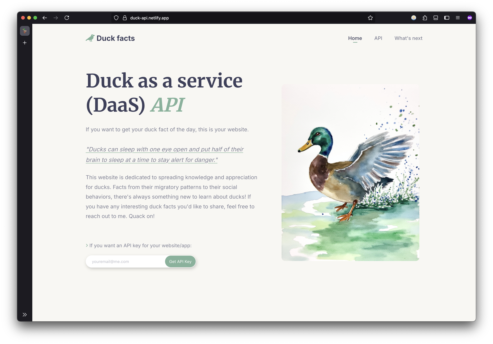
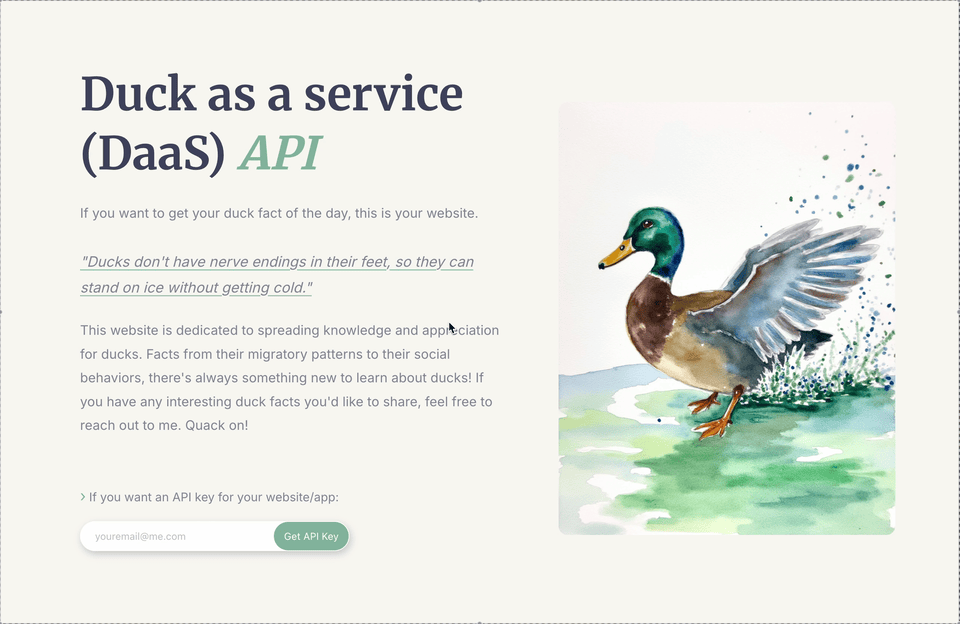

<h2 align="center">
  Ducks-Facts API 🦆 
</h2>

<p align="center"></p>

[<h2 align="center">Deployment status:‎ ‎ ](https://app.netlify.com/projects/duck-api/deploys)</h2>
<br>
This API provides a simple way to access interesting and random facts. The API will have images available soon.

## Getting Started

To start using the ducks-facts API, you'll first need to register to obtain an API key. This key will be used to authenticate your requests and track your usage.

`base url - https://duck-api.netlify.app`

### Register for an API Key

To register for an API key, fill out the form on our [website](https://duck-api.netlify.app/). You’ll receive your key by email.
<br>

<p align="center"></p>

```json
{
  "message": "Registration successful!",
  "apiKey": "YOUR_NEWLY_GENERATED_API_KEY",
  "initialCredits": 500
}
```

## Authentication

All authenticated endpoints require your API key to be sent in the `X-api-key` header of your HTTP requests.

**Example Header:**

```
X-api-key: YOUR_API_KEY_HERE
```

## Endpoints

### 1. Get a Random Fact

`GET /api/facts/random`

This endpoint returns a random, interesting fact. You must provide your API key in the request headers.

### Headers:

- `X-api-key`: Your API key.

```json
{
  "id": 54,
  "fact": "Most duck species are monogamous for a breeding season but typically find new mates each year."
}
```

### 2. Check API Usage

`GET /api/usage`

This endpoint allows you to check your remaining API credits. You must provide your API key in the request headers.

### Headers:

- `X-api-key`: Your API key.

```json
{
  "message": "API usage details",
  "remainingCredits": 481
}
```

### 3. Get a Random Image

`GET /api/image/random`

This endpoint allows you to check your remaining API credits. You must provide your API key in the request headers.

### Headers:

- `X-api-key`: Your API key.

```json
{
  "id": 32,
  "url": "https://ik.imagekit.io/duckapi/32.jpg"
}
```

## Next steps

- [x] ~~Add some high-quality duck images~~
- [x] ~~Expand API endpoints for image delivery~~
- [ ] The chance to add custom duck facts into the API
- [ ] Community image upload
- [ ] Posibility to search image and fact by id
